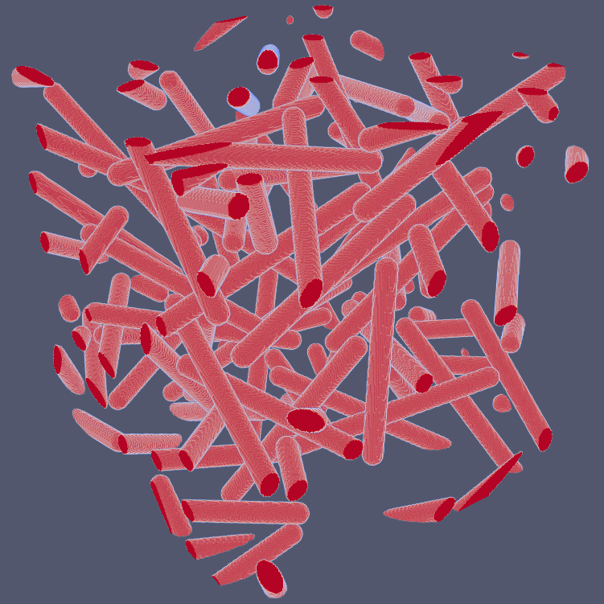
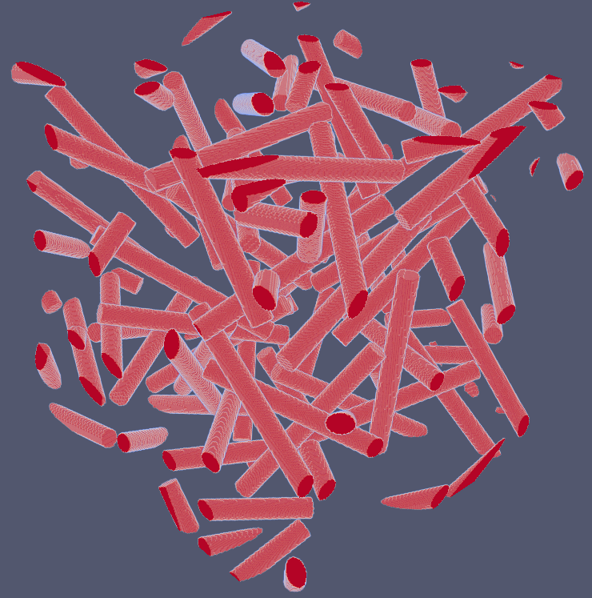
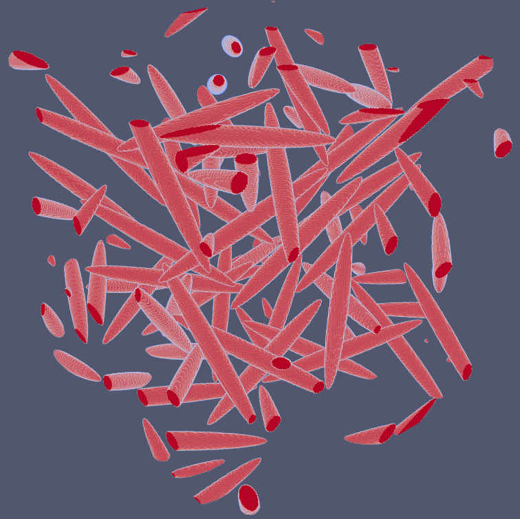
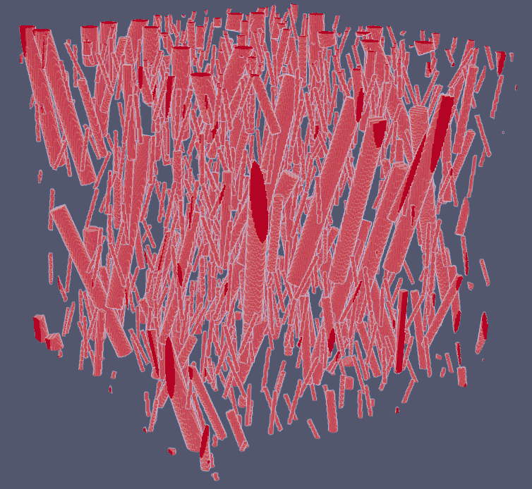

# Generatix

This repository contains some tools for generation of microstructures.

spherocylinders.py : tools for generation of a microstructure of hard spherocylinders, with RSA (requires numba). The non-overlapping test is 
done by computing the distance between segments. That is why, a microstructure of non-overlapping spherocylinders is obtained.
The microstructure is periodic in the three directions.

voxel.py : tools for voxelization of a microstructure (requires numba, and vtk is used for visualization but can be removed). This offers
the possibility to voxelize a microstructure, starting from centers, normals, radii and lengths, to obtain different shapes: cylinders, spherocylinders,
or spheroids.

examples.py : demos

## Examples

The following microstructures were generated by Random Sequential Algorithm with the non-overlaping test mentioned above.
The microstructure is periodic in the three directions. Three possible shapes are shown: spherocylinders, cylinders and spheroids.
There is no overlap.
 
 
<table align="center">
  <tr>
    <td align="center">
       
      <em>Spherocylinders</em>
    </td>
    <td align="center">
       
      <em>Cylinders</em>
    </td>
    <td align="center">
       
      <em>Spheroids</em>
    </td>
  </tr>
</table>

The tools allow to generate polydisperse microstructures, which means that the user must provide a numpy array
giving the desired lengths, radii and volume fractions associated. Here, a first example is generated with a
uniform distribution of orientations ("random"), and another example is generated by considering a uniform distribution
of orientations, between two limit angles.

<table align="center">
  <tr>
    <td align="center">
       
      <em>Polydisperse hard cylinders, random orientation</em>
    </td>
    <td align="center">
       
      <em>Polydisperse hard cylinders, particular distribution of orientations</em>
    </td>
  </tr>
</table>